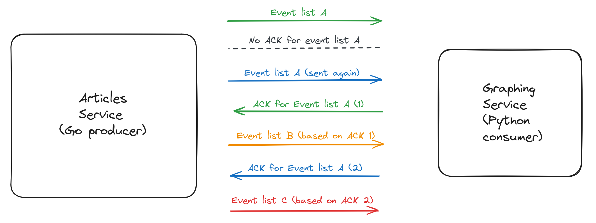

## Intro

This year, one of my resolutions was that I would read more. My perhaps rather ambitious goal was to read every day, even if just for a bit, and to finish 10 books this year. And honestly, so far it’s not really looking great. But at least [Domain-Driven Design by Vlad Khononov](https://www.amazon.com/Learning-Domain-Driven-Design-Aligning-Architecture/dp/1098100131) has got me hooked, and I just managed to finish it.

Another one of my resolutions was that I would publish more articles, so let’s not talk about it and please don’t look at my profile.

Anyway, back to DDD. At one of the chapters, the author introduces a pattern for reliable message publishing, called the **outbox pattern**. The description pretty much sums it up. If you’re working with a system where a business operation both updates state and publishes some events, this pattern helps keeping consistency between current state and consumed events.

This may sound a bit abstract at first, and perhaps it’s not straightforward to make something concrete out of it. In fact, the need for this pattern might not be obvious yet. The book has a full chapter dedicated for this pattern, which I warmly recommend if you want to understand it more in depth. If you don’t own the book, [this article](https://www.baeldung.com/cs/outbox-pattern-microservices) is a nice free resource.

In short, rather than just sending events and updating the database state separately, events are also stored in the database, atomically with the updated state. Some mechanism takes the events out of the database, publishing them to a relay or queue, where they reach consumers.

Basically, the difference from a straightforward approach of publishing the events to the queue directly the moment they were generated is the local persistence. This helps against issues such as publishing the events successfully, but failing to persist the new state.

However, I find it nice when learning a new pattern to build something “practical” with it. I believe it does a great job at *internalizing* the concepts you’re learning, because:

* It enables you to understand the shortcomings of simpler approaches, and the benefits of adopting the pattern;

* It forces you to fully understand the pattern, discover edge cases and make tradeoffs, or you risk a flawed or onerous solution;

* It offers you a good idea of the implementation complexity.

Besides, you will see in this article that modelling real-world use cases, even in a simplified scenario, to make room for this pattern comes with quite some challenges on its own. By doing this, you end up learning much more than what you initially desired, and it’s an excellent refresher of your coding knowledge.

Enough, let’s dive into the concrete stuff. I’ll walk over my entire process, from modelling a simplified environment that could use the outbox pattern, to writing a full implementation from the ground up. I’m going to share all the challenges I encountered, as well the trade-offs I decided to make for the sake of simplicity and readability. I will also be pointing out a lot of practices I followed from a DDD perspective.

The code was pretty much written concurrently with this article, trying to portray my journey as accurately as possible. I’m hoping this would help give some insights into things like feature prioritization, analyzing alternatives and being pragmatic in terms of time spent and code complexity.

If you’re interested in some of my deeper thoughts or observations, subscripts[⁰](https://medium.com/@ozoniuss/implementing-the-outbox-pattern-from-scratch-by-following-ddd-9972eae4f1ab#9bda) point to paragrahps at the end of the article. External references are either specified through links or like this [[EXA](https://example.com/)]. Just click on them and they will take you to the right place.
> NOTE: Linking a medium paragraph is more complicated than it needs to be. I hope your links will work. If they don’t, sorry :/

## Defining the problem space

The very first step of this journey is defining our environment, the boundary where all the code we’re going to write lives. Let’s assume the following scenario: we’re building a Medium competitor where people can post articles. A fancy new feature this competitor provides is a public “like graph” for any author. Essentially, when we go to an author’s profile, we can see a graph displaying their rate of likes accross all stories, in time. Pretty cool and competitive, huh? (and definitely not useless!)
> Domain-Driven Design calls this a **core subdomain**: something that a company is doing different to get an edge over the competition.

Alright, so let’s think about the data that needs to be collected. Just to draw the graph mentioned previously, for a single like we have to store:

* The timestamp of when the like happened, which will give us datapoints to create a time series;

* The author that received the like, so we only use their likes when creating the graph.

Additional information such as the article that received a like, or the person who had liked the article could also be interesting for new features not yet discovered. Maybe in the future we’ll want to show each story’s “highlight” (the day it received most likes). Consequently, our solution should be relatively *easy to change* for potential unknown new features.

From a design perspective, we can model this as a service managing articles (article service), that emits events to another service whenever an article receives a like. This other service is responsible for drawing and storing the graphs (graping service). We should assume that it’s crucial to have consistency between the article like count stored in the main service and the events from the graphing service, so there should not be any dropped or duplicate events. **Eventual consistency** is what we’re looking for here.

This is a bit forced, but hey, that’s all I could come up with.
> I’m ok with this light coupling between the like count and liked events in different services. It aids with the load if you want to display a list of authors and show their total number of likes in that list.

I will be writing the articles service in Go, the graphing service in Python (mainly because of Matplotlib) and I will follow Domain-Driven Design while doing so. However, none of these is a hard requirement to implement an outbox.

Now we have enough information to start implementing our simple example. There is no need to go above and beyond here, we just need a proof of concept (**PoC**). Let’s begin by putting up a model for our fictional service, starting with the article itself:

```go
// Article is an aggregate encapsulating an article's state. It exposes
// methods to mutate the article which ensure an article's consistency.
type Article struct {
    Id          int
    AuthorId    int
    Content     string
    Likes       int
    PublishedAt time.Time
    ModifiedAt  time.Time
}
```

Note that an **aggregate** is a domain-driven design concept. The main purpose of an aggregate is that we’re always internally protecting this object’s consistency through the public methods we expose to mutate it. Let’s also create some of these methods:

```go
// Like should be called when an author's article receives a like.
func (a *Article) Like() {
    a.Likes++
}
```

```go
// UpdateContent should be called when an author updates his article.
func (a *Article) UpdateContent(newContent string) {
    a.Content = newContent
    a.ModifiedAt = time.Now()
}
```

The aggregate is pretty much applying the *abstraction *and *encapsulation* principles behind OOP. I like to point this out because I find that there are way to many terms in our industry that just refer to nuances of the same underlying concept. The design pattern that makes use of aggregates is called **domain model**.

There are some useful considerations when designing aggregates. First, here its properties are public only for simplicity (In Go, uppercase fields are public). If we truly wanted to *enforce* the aggregate pattern, we’d make the properties readonly. That’s not because mutable fields are inherently prohibited, but every change to the aggregate must keep it in a valid state. In our case, it doesn’t really make sense to allow randomly changing the like count, or updating the content without the modified timestamp.

Second, we should be careful when creating aggregates for the first time. It’s not that hard to end up with an invalid author or timestamps. Typically, after this object had been created, you would use it in the following way:

* Load the aggregate’s current state from storage;

* Update its state during a business operation, via its public methods or fields, which protects internal constraints;

* Save the new state, whilst doing everything atomically in a transaction.

This helps making it easy to always keep a valid state, while writing very expressive code. Though, it’s always a good exercise to think and compare different ways[⁹](https://medium.com/@ozoniuss/implementing-the-outbox-pattern-from-scratch-by-following-ddd-9972eae4f1ab#302b) to achieve this: validators, database constraints, etc.

The other model we have to define is the “like” data. This is going to be the payload of an event emited by the articles service when calling the Like() method. It could look something like this:

```go
// ArticleLikedEvent models the payload of an event emitted when an
// author's article receives a like.
type ArticleLikedEvent struct {
    EventId   int
    ArticleId int
    Timestamp time.Time
}
```

> If using Go, it’s probably best to always export these fields. That is because we will have to serialize these events at some point. Generally, only exported fields are serialized in Go by default, without any additional workarounds.

This is simple enough for now. We can always come back to add more fields if we need them.

As long as the code is easy to change, I like the approach of starting with a simple but robust enough implementation, following good practices and adjusting it based on needs discovered along the way. It gives an ideal balance between complexity, readability and implementation speed. Adding new fields is almost always a forwards and backwards compatible change. [[MK](https://medium.com/@ozoniuss/implementing-the-outbox-pattern-from-scratch-by-following-ddd-9972eae4f1ab#dafc)]

We are not done yet. If following DDD, domain events are part of an aggregate’s public interface, and are emitted by the aggregate itself[¹](https://medium.com/@ozoniuss/implementing-the-outbox-pattern-from-scratch-by-following-ddd-9972eae4f1ab#cee7). So let’s make that explicit in our code:

```go
type Article struct {
    // ...
    likedEvents []ArticleLikedEvent
}

// GetLikedEvents returns all liked events that were generated when performing
// some business logic through the article aggregate.
func (a *Article) GetLikedEvents() []ArticleLikedEvent {
    return a.likedEvents
}
```

And finally, adjust the Like() method accordingly:

```go
func (a *Article) Like() {
    a.Likes++

    a.likedEvents = append(a.likedEvents, ArticleLikedEvent{
        ArticleId: a.Id,
        Timestamp: time.Now(),
    })
}
```

> The decision to return an ArticleLikedEvent array was pretty much arbitrary and perhaps not the best one. It’s too late to change it now, so I thought I’d mention that it’s worth experimenting with approaches that help reducing code duplication. Having an event interface and returning a list of generic events instead ( GetNewEvents for instance) would have probably been a better idea.

We are in a good state with the aggregate. Before we’re able to use it in practice and send liked events reliably, we need some storage. So, it’s time to define some storing capabilities. Let’s roll in a ports & adapters [[VK](https://medium.com/@ozoniuss/implementing-the-outbox-pattern-from-scratch-by-following-ddd-9972eae4f1ab#7c62)] fashion to specify the requirements of our data source:

```go
// ArticleStorage is a port which specifies the required interactions between
// the application and a data source containing all articles.
type ArticleStorage interface {
    // Insert inserts a new article, or returns an error if the article already
    // exists.
    Insert(a Article) (Article, error)
    // Get retrieves an article, or returns an error if the article does not
    // exist.
    Get(a Article) (Article, error)
    // Update updates an article that matches the input article's id, or returns
    // an error if there is no such article.
    Update(a Article) (Article, error)
}
```

Together with our lazy implementation:

```go
// InMemoryArticles is our in-memory database, and also an adapter for our
// articles storage.
type InMemoryArticles struct {
    // a wannabe postgres database
    articles []Article
}

// Implementation of ArticleStorage methods
// ...
```

> Oversimplified, the main idea behind ports & adapters is defining **specifications** in your business logic with the requirements of external components, and providing **implementations** for these interfaces in separate “infrastructure” modules. The specifications, often achieved via interfaces, are called ports, and the implementations adapters. Then, you can easily change “adapters” for a given “port”.

So far, so good. I won’t be showing yet the implementation of each method because it doesn’t really matter at this stage. We only need to understand the capabilities, defined by our specification.

Now, in order to achieve the outbox design pattern, we also need a way to persist domain events at the storage layer, alongside our aggregate’s state. Let’s extend the database with that capability:

```go
// Since the outbox is now part of the storage, we need to expose some
// methods to interact with it in the port.
type ArticleStorage interface {
    // ...

    // InsertArticleLikedEvent stores an article liked event in the outbox
    // table.
    InsertArticleLikedEvent(e ArticleLikedEvent) (ArticleLikedEvent, error)
}

type InMemoryArticles struct {
    // ...
    outbox []ArticleLikedEvent
}
```

The storage could also be a Postgres database, a Mongo database or even a simple file. We can implement an outbox on all of those storage types, and we can even make it really easy so change between storage types through a start-up config. So, I just picked a straightforward one. Or at least, what I thought should have been a straightforward one. It gets complicated really quick[²](https://medium.com/@ozoniuss/implementing-the-outbox-pattern-from-scratch-by-following-ddd-9972eae4f1ab#3282).

It’s time to emit domain events.

## Emitting events

The part of our PoC that will emit the ArticleLikedEvent events is the aggregate’s Like() method. However, that’s not going to be the place where the code for calling the database storage lives. That would require the aggregate to be aware of how to use the storage, which is beyond its purpose. In fact, it likely leads to [layered architecture](https://www.oreilly.com/library/view/software-architecture-patterns/9781491971437/ch01.html), which is an alternative to ports & adapters that we’re avoiding here.

This is why in DDD, domain events are part of an aggregate. We could think of the business logic for the entire process of liking an article as something like the code below:

```go
func LikeArticle(articleId int) error {
  // Load the aggregate state and apply business logic.
    article, err := storage.Get(articleId)
    if err != nil {
        return fmt.Errorf("could not retrieve article")
    }

    // Update aggregate's state and get the events that were
    // generated as a result.
    article.Like()
    events := article.getLikedEvents()

    // Store the new state and domain events in the same database.
    _, err := storage.Update(article)
    if err != nil {
        return fmt.Errorf("could not update article: %s", err.Error())
    }
    for _, e := range events {
        err := storage.InsertArticleLikedEvent(e)
        if err != nil {
            return fmt.Errorf("could not insert liked event: %s", err.Error())
        }
    }
    return nil
}
```

This method may be called for example from an HTTP handler, or be part of a service. Its name matches a possible business operation.
> An important note to make here is that loading an article’s state (e.g. by calling storage.Get()) should instantiate an article **without any existing events**! Refer to [[1](https://medium.com/@ozoniuss/implementing-the-outbox-pattern-from-scratch-by-following-ddd-9972eae4f1ab#cee7)] for more details.

We are progressing well, we already have some business logic set up. But, this code omitted a very important aspect of the outbox pattern: that the new aggregate’s state and the new domain events should be stored in the database **atomically**. What if the code would crash after updating the article, but before storing the events in the outbox?

```go
_, err := storage.Update(article)
if err != nil {
    return fmt.Errorf("could not update article: %s", err.Error())
}
// :(
for _, e := range events {
    err := storage.InsertArticleLikedEvent(e)
    if err != nil {
        return fmt.Errorf("could not insert liked event: %s", err.Error())
    }
}
```

Note that I’m talking about crashes within the code executing the business logic, which is likely happening in a separate execution context like a different thread[¹¹](https://medium.com/@ozoniuss/implementing-the-outbox-pattern-from-scratch-by-following-ddd-9972eae4f1ab#5937). Obviously, with an in-memory database, we lose all data if the entire process goes down. That is still no reason to overlook transactional boundaries, a valid concern when working with a real database, or when multiple systems are interacting in general.

The least we could do is guard against data corruption from multiple threads accessing the in-memory database at the same time[¹⁰](https://medium.com/@ozoniuss/implementing-the-outbox-pattern-from-scratch-by-following-ddd-9972eae4f1ab#1eed). Consider the following scenario:

* *What if the InsertArticleLikedEvent database function would check that the event’s article Id must be in the articles array? If a different thread would finish delete the article just before the for loop, we would end up in an inconsistent outbox state, because the article’s state has changed and the number of likes increased, but inserting the liked event will error.*

Thus, let’s add a very basic locking mechanism to our database. To avoid complex multithreaded logic[³](https://medium.com/@ozoniuss/implementing-the-outbox-pattern-from-scratch-by-following-ddd-9972eae4f1ab#de49), let’s just assume that every operation exposed by the storage is performed atomically. The advantage of this approach is that it can be done easily by adding a mutex:

```go
type InMemoryArticles struct {
    // we want to seem sophisticated
    mu sync.Mutex
}
```

Now all operations will have to use the mutex:

```go
func (repo *InMemoryArticles) Insert(article Article) (Article, error) {
    repo.mu.Lock()
    defer repo.mu.Unlock()

    repo.articles = append(repo.articles, article)
    return article, nil
}
```

The disadvantage with a single mutex is that we can’t do multiple operations as part of the same transaction, since each operation would require locking the database first, resulting in deadlocks. So we have to define a new method on the storage to implement our like feature:

```go
type ArticleStorage interface {
    // ...
    // UpdateArticleAndInsertLikedEvents commits the changes to an article's
    // state atomically with the events it emitted.
    UpdateArticleAndInsertLikedEvents(a Article, events []ArticleLikedEvent) error
}


func LikeArticle(articleId int) error {
    // load the aggregate state and apply business logic
    article, err := storage.Get(articleId)
    if err != nil {
        return fmt.Errorf("could not retrieve article")
    }

    article.Like()
    events := article.getLikedEvents()

    // commit the aggregate's state and domain events atomically to the
    // database
    err = storage.UpdateArticleAndInsertLikedEvents(article, events)
    if err != nil {
        return fmt.Errorf("could not update article state after like: %s",
        err.Error())
    }
    return nil
}
```

Requiring a new method for every combination of operations is definitely not ideal, leading to quite some boilerplate and potentially repeated code. There is also duplication in having to lock and unlock during every operation. However, it makes room for optimizations like performing multiple operations via a single query, and the good protection against panics ([a Go concept](https://go.dev/blog/defer-panic-and-recover), think of it as thread failure) and concurrent database access is sufficient to make this trade-off and move forward.

Told you, it got complicated really quick. :)

Wrapping up with the full implementation, including the public HTTP interface:

```go
func main() {
    // Initialize the storage. Based on config, this could instantiate
    // different types of storage, e.g. real postgres
    storage := NewInMemoryArticles()
    requestHandler := NewHandler(storage)

    // GO 1.22 :)
    http.HandleFunc("POST /articles/{id}/like", requestHandler.HandleLikeArticle)
    // other handlers
}

// handler holds the data that is shared accross requests and defines
// HTTP handlers for requests.
type handler struct {
    storage ArticleStorage
}
func NewHandler(storage ArticleStorage) handler {
    return handler{storage: storage}
}

func (h *handler) HandleLikeArticle(w http.ResponseWriter, r *http.Request) {
    // HTTP handler logic
    articleIdStr := r.PathValue("id")
    articleId, err := strconv.Atoi(articleIdStr)
    if err != nil {
        w.WriteHeader(http.StatusBadRequest)
        return
    }

    // start of bussiness logic
    err = LikeArticle(articleId)

    // continue HTTP handler logic
    if err != nil {
        fmt.Printf("got error: %s\n", err.Error())
        w.WriteHeader(http.StatusInternalServerError)
        fmt.Fprint(w, ":(")
        return
    }
}

// other handlers implementation
```

This is how the entrypoint of the application would typically look like.

Of course, I’ve not talked nor implemented things like logging, proper error handling, middleware, service config, metrics and things like that to keep the implementation simple and easy to follow. This article is long enough as is. Now, it’s time to move on to actually publishing some events.

## The consumer

Alright, we are in a good state to start the implementation for reliably sending events to the consumer. We are going to use a pull-based approach. That is, we are going to have a separate goroutine polling the database repeatedly (say, every 5 seconds, for PoC) and send these events to a different process. At a high level, the code will look something like this:

```go
// poll queries the inmemory database at the specified interval, sending
// away the new events to the consumer.
func poll(interval time.Duration) {
    ticker := time.NewTicker(interval)
    go func() {
        for {
            // wait for the timer to fire every cycle
            <-ticker.C
            sendUnconsumedEvents()
        }
    }()
}
```

Obviously, this is highly simplified. It abstracts away details such as:

* the connection between the poller and the database;

* the mechanism for figuring out the unconsumed events;

* the logic required to communicate with the consumers.

Let’s take these one by one and build our poller abstraction from ground up. Starting with the first point, our poller needs access to the database. This would look something like this:

```go
// LikedArticlesPoller provides a mechanism for sending liked article events
// to a downstream consumer.
type LikedArticlesPoller struct {
    storage ArticleStorage
}

func NewLikedArticlesPoller(storage ArticleStorage) *LikedArticlesPoller {
    return &LikedArticlesPoller{storage: storage}
}

func (p *LikedArticlesPoller) poll() {
    // polling logic implementation
}
```


Our poller is now aware of the database, which is passed down via dependency injection. As we saw previously, it takes in an ArticleStorage structure, rather than an InmemoryArticleStorage . This is essential to make it easy to change storage implementations (or switch “adapters”).

Next in line is figuring out a mechanism to determine which events have to be sent every polling cycle. This depends on our outbox implementation, so let’s list approaches. We could either:

* delete the events that have already been consumed, or

* keep all events, and an index tracking the first event that had not been consumed.

I will just go ahead and pick the second one because it’s simpler to implement. It may not seem like it, but the former comes with significant disadvantages, even just for implementing this simple PoC[⁴](https://medium.com/@ozoniuss/implementing-the-outbox-pattern-from-scratch-by-following-ddd-9972eae4f1ab#a45f).

Let’s add this capability to our poller. The poller itself needs an index to know which events have not yet been sent to the downstream:

```go
type LikedArticlesPoller struct {
    // ...
    lastEventIndex int
}
```

And the storage medium needs to offer the possibility to retrieve all events starting from a different index. Let’s extend our storage interface:

```go
type ArticleStorage interface {
    // ...
    // GetArticleLikedEventsFromIndex returns all events starting from a
    // specific index.
    GetArticleLikedEventsFromIndex(i int) ([]ArticleLikedEvent, error)
}
```

By adding this change, the storage abstraction might seem leaky. It looks like it exposes the fact that liked events are stored in order, in an array-like container. However, I don’t necessarily see it that way, because it’s reasonable to expect an order relationship over these events. To me, the index only reveals that these events have been ordered (and maybe that adding a new event doesn’t change their ordering), acting similar to an id[⁵](https://medium.com/@ozoniuss/implementing-the-outbox-pattern-from-scratch-by-following-ddd-9972eae4f1ab#e4f4). We are aware of these characteristics when implementing the outbox.

With all these changes, let’s complete our poll() code:

```go
func (p *LikedArticlesPoller) poll(interval time.Duration) {
    ticker := time.NewTicker(interval)
    go func() {
    for {
        <-ticker.C
        newEvents, err := p.storage.GetArticleLikedEventsFromIndex(p.lastEventIndex)

        // I promise this is not how I handle errors in production code.
        if err != nil {
            fmt.Printf("error retrieving latest events, aborting: %s\n", err.Error())
            break
        }

        err = p.sendNewEvents(newEvents)
        if err != nil {
            fmt.Printf("did not manage to send new events: %s\n", err.Error())
        }
    }
    }()
}
```

While we’re at it, let’s also shift the location of the poll interval inside the LikedArticlesPoller itself:

```go
type LikedArticlesPoller struct {
    // ...
    pollInterval time.Duration
}

func (p *LikedArticlesPoller) poll() {
    ticker := time.NewTicker(p.pollInterval)
    // ...
}
```

We’re doing good progress; our outbox is starting to shape up. By this point, you may have noticed that the poller introduced a race condition within our code: liking an article can happen “simultaneously” (conceptually, at least) with polling the liked events. Thankfully, the solution we designed for storing events atomically with the new article’s state helps us out in this case as well. We just have to remember to add the mutex logic inside the method retrieving the events:

```go
func (repo *InMemoryArticles) GetArticleLikedEventsFromIndex(index int)
    ([]ArticleLikedEvent, error) {
    repo.mu.Lock()
    defer repo.mu.Unlock()

    return slices.Clone(repo.outbox[index:]), nil
}
```

The last functionality is connecting and communicating with consumers. I don’t want to spend a lot of time here, so I’ll just point out a basic approach: send events through a TCP connection, and wait for an ACK from the consumer.

We can split this step in two parts, that is, creating the TCP connection and sending the data. Setting up the connection belongs to the poller creation logic, so let’s pass in the TCP socket information:

```go
type LikedArticlesPoller struct {
    // ...
    conn net.Conn
}

func NewLikedArticlesPoller(storage ArticleStorage, pollInterval time.Duration,
    authority string) (*LikedArticlesPoller, error) {

    // authority is the fancy RFC 3986 name for host + port
    conn, err := net.Dial("tcp", authority)
    if err != nil {
        return nil, fmt.Errorf("could not connect to downstream: %s", err.Error())
    }

    return &LikedArticlesPoller{
        storage:        storage,
        lastEventIndex: -1,
        pollInterval:   pollInterval,
        conn:           conn,
    }, nil
}
```

Now the poller holds enough information to write the sendNewEvents method. The logic is simple: send the events, and wait for an ACK. If we succeed, increment the index with the number of events we sent. If either fails, do nothing.

```go
func (p *LikedArticlesPoller) sendNewEvents(events []ArticleLikedEvent) error {

    // encode the events as json before sending them
    enc := json.NewEncoder(p.conn)
    err := enc.Encode(events)
    if err != nil {
        return fmt.Errorf("could not send events: %s", err.Error())
    }

    var ack bool
    dec := json.NewDecoder(p.conn)
    err = dec.Decode(&ack)
    if err != nil {
        return fmt.Errorf("failed reading ack from consumer: %s", err.Error())
    }

    // This is not particularly necessary, just an extra sanity check.
    if ack {
        p.lastEventIndex += len(events)
    }
    return nil
}
```

Notice that, in order to send the events over the wire, we had to encode them in some way. The decision to choose JSON was pretty much done for simplicity, but it’s not the most efficient one and there are arguments for other approaches[⁶](https://medium.com/@ozoniuss/implementing-the-outbox-pattern-from-scratch-by-following-ddd-9972eae4f1ab#128a). Remember that I said before the event fields have to be exported? With JSON, I also like to make it explicit how the serialization result will look like, which requires a small change:

```go
// Specify which fields to match from the json encoding.
type ArticleLikedEvent struct {
    EventId   int       `json:"event_id"`
    ArticleId int       `json:"article_id"`
    Timestamp time.Time `json:"timestamp"`
}

// encoded article liked event example
{"event_id":1,"article_id":2,"timestamp":"2024-03-30T16:27:43.846537102+02:00"}
```

Awesome. This will enable the Python consumer to understand how to read the incoming events.

The primary logic is almost fully sketched out now, but still not complete. First, we have configured a polling interval, but what happens if we don’t receive an ACK from the consumer until that interval expires? This will delay the next polling cycle, which is undesirable.

Besides, you need some sort of heuristics anyway in distributed systems to determine whether or not a participating process has crashed or not. In our example, adding a timeout will be good enough. This should be smaller than the poll interval, so for simplicity let’s just say it’s one second less:

```go
type LikedArticlesPoller struct {
    // ...
    timeout time.Duration
}

func NewLikedArticlesPoller(storage ArticleStorage, pollInterval time.Duration,
    authority string) (*LikedArticlesPoller, error) {
    // ...
    timeout := pollInterval - 1*time.Second

    return &LikedArticlesPoller{
        // ...
        timeout: timeout,
    }, nil
}

func (p *LikedArticlesPoller) sendNewEvents(events []ArticleLikedEvent) error {
    // ...

    // If the ack is not received after the timeout, we consider that the
    // consumer failed. This is the Go way of doing so with TCP sockets.
    p.conn.SetReadDeadline(time.Now().Add(p.timeout))

    dec := json.NewDecoder(p.conn)
    var ack bool
    err = dec.Decode(&ack)
    // ...
}
```

Secondly, it’s important we avoid “duplicate” ACKs. This is quite a subtle one and easy to miss out, but can lead to one of the hardest bugs to fix. Assume you send out an event that doesn’t get ACK-ed in a timely manner. The next polling cycle, you send the same event again, and you receive an ACK. Thus, you increase the index and the next cycle you send new events. Can you trust the next ACK that comes in?

The answer is no. Was the currently received ACK a response to the first, or second event? What if the next ACK isn’t meant for the last event? Consider the following timeline diagram:





This can lead to an invalid state if the graphing service *failed to persist
event list B properly*, and would not have sent an ACK for those. The producer misinterprets the delayed ACK as if it were meant for event list B.

Therefore, we need some sort of mechanism to match an ACK to a message that was send by the producer. This is unfortunately not straightforward[⁸](https://medium.com/@ozoniuss/implementing-the-outbox-pattern-from-scratch-by-following-ddd-9972eae4f1ab#4c19), so I’ll skip explaining the choices I made in this code, however feel free to check the reference or the code comments where I justify why that is the case. I will just attach the final version of the code (warning: it’s pretty long)[¹²](https://medium.com/@ozoniuss/implementing-the-outbox-pattern-from-scratch-by-following-ddd-9972eae4f1ab#8139).

```go
type LikedArticlesPoller struct {
    // ..

    // Do not send new events until this specific one is acked. This also
    // means not fetching any new events until that point.
    unacked        Message
    lastEventAcked bool
}
func (p *LikedArticlesPoller) sendNewEvents(events []ArticleLikedEvent) error {

    // If there are no events, there is no point in sending anything,
    if len(events) == 0 {
        return nil
    }

    // Create a new message. If last event was not acked, the ACK may have
    // been lost or will come with delay. Send the same event, to ensure
    // that the ACK is generated again in case it was lost due to network
    // failure.
    //
    // Note that not using latest events plays an important role here, if
    // new events were generated. If this includes new events since an unacked
    // event was send, it gets hard to keep track of what the consumer has
    // actually persisted, and it may lead to missed events.
    var message Message
    if !p.lastEventAcked {
        message = p.unacked
    } else {
        message = Message{
            Id:     events[0].EventId,
            Events: events,
        }
    }

    // re-creating the encoder and decoder is necessary, see [12]
    enc := json.NewEncoder(p.conn)
    err := enc.Encode(message)
    if err != nil {
        return fmt.Errorf("could not send events: %s", err.Error())
    }

    // If the ack is not received after the timeout, we consider that the
    // consumer failed.
    p.conn.SetReadDeadline(time.Now().Add(p.timeout))

    var ack Ack
    dec := json.NewDecoder(p.conn)

    // Note that if we sent the same event multiple times, it doesn't matter
    // that the ACK may be delayed, nor that we may receive multiple ACKs.
    // We only need a single ACK for this particular message. Since we won't
    // send new messages, it will catch up in the end.
    //
    // If we only read from the consumer once per polling interval, we risk
    // ending up with significant delay if we keep missing ACKs. To mitigate
    // that, we updated the code to keep reading from the consumer until the
    // deadline.
    var loopErr error
LOOP:
    for {
        err = p.dec.Decode(&ack)
        // this error includes timeout
        if err != nil {
            var e *net.OpError // internal net error
            ok := errors.As(err, &e)
            if !ok {
                // this covers all errors, including decoding errors. It means
                // the event did not get acked properly.
                p.lastEventAcked = false
                p.unacked = message
                loopErr = err
            } else {
                if e.Timeout() {
                    // This also counts as not being acked, especially the first
                    // time. The difference here is that we're breaking the
                    // loop.
                    p.lastEventAcked = false
                    p.unacked = message
                    loopErr = err
                    break LOOP
                }
            }
            return fmt.Errorf("failed reading ack from consumer: %s", err.Error())
        } else {
            // Received an ACK for a previous message. We can disregard this.
            if ack.Id != message.Id {
                p.lastEventAcked = false
                p.unacked = message
            } else {
                // proper ACK. we should break the loop.
                p.lastEventAcked = true
                p.unacked = Message{}
                break LOOP
            }
        }
    }

    if loopErr != nil {
        return fmt.Errorf("failed to ack; last received error: %s", err.Error())
    }
    return nil
}

```

One final thought: this pattern, the way we implemented it here, guarantees at [least once delivery](https://jack-vanlightly.com/blog/2017/12/15/rabbitmq-vs-kafka-part-4-message-delivery-semantics-and-guarantees). It’s up to the consumer to make sure that the received events are not duplicated[⁷](https://medium.com/@ozoniuss/implementing-the-outbox-pattern-from-scratch-by-following-ddd-9972eae4f1ab#3aef). You can find the full Python consumer code [here](https://github.com/Ozoniuss/misc/blob/main/outbox/main.py), and a short sketch below[¹³](https://medium.com/@ozoniuss/implementing-the-outbox-pattern-from-scratch-by-following-ddd-9972eae4f1ab#1c2f):


```python
@dataclass
class ArticleLikedEvent:
    event_id: str
    article_id: str
    timestamp: str


@dataclass
class Message:
    id: int
    events: list[ArticleLikedEvent]


@dataclass
class Ack:
    id: int


# local replica
receivedEvents: list[ArticleLikedEvent] = []
# all events that were already acked
acked = set()

with socket.socket(socket.AF_INET, socket.SOCK_STREAM) as s:
    s.bind((HOST, PORT))
    s.listen()
    conn, addr = s.accept()
    with conn:
        while True:
            try:
                # Random size, I did not put any thought into it.
                data = conn.recv(1024 * 1024 * 10).decode("UTF-8")

                # convert json into message object
                message = Message(**json.loads(str(data)))

                # Here you could either re-ack or skip, but skipping is
                # not the right choice. If a previous ack fails due to
                # network failure, the producer will keep sending a message
                # that was already processed until it's acked.
                if message.id not in acked:
                    # Generate the events only if it's a new message.
                    message.events = [ArticleLikedEvent(**e) for e in message.events]

                    # extend the local replica
                    receivedEvents.extend(message.events)

                ack = json.dumps(asdict(Ack(id=message.id)))
                # Mark the event as acked to ignore it next time
                # it comes.
                acked.add(message.id)
                conn.sendall(bytes(ack, encoding="utf-8"))

            # generate the graph upon ctrl + C
            except KeyboardInterrupt:
                generate_like_graph(receivedEvents)
                break

            except Exception as e:
                print("unknown failure", e)
                break
```

Also, here’s a “like graph” generated by the consumer’s replicated data, from the articles service. I used [a script](https://github.com/Ozoniuss/misc/blob/main/outbox/like.go) to send requests to the articles service, with Python consumer running. The story wouldn’t be complete without it, right?

*Example like graph for an author*

Alright, this was a lot to take in. If you’ve managed to make it this far, thank you for reading! I hope this managed to walk you through the steps of putting up the implementation for the outbox design pattern from ground up, whilst also pointing out certain things to keep in mind during the implementation process. Writing this article at the same time with the code to keep things accurate was a nice experiment and, even though it took me several evenings of free time, I greatly enjoyed all of it.

If you haven’t had enough, below are some of my extra thoughts that came up during the implementation process. I think they manage to do a good job showing why distributed systems are complicated, and how certain algorithms that seem easy at first glance can end up complicated really quickly.

Would you like to see a walkthrough that tests extensively if this works as expected? Let me know in the comments!

## Notes

Full implementation available [on my Github](https://github.com/Ozoniuss/misc/tree/main/outbox). It’s slightly different (e.g. with added logs for debugging), but the functionality is the same.

[0]: This is the very first subscript.

[1]: It was hard for me to grasp why at first, but it makes sense. The main purpose of an aggregate is consistency. It is not aware of databases or externals components like queues. By emitting events only from within an aggregate’s public methods and storing them in the aggregate, that consistency is kept. Once you loaded and modified the aggregate, you can retrieve everything that has changed: the new final state and the emitted events. The responsibility of ensuring that the new state is reflected properly (both events were delivered to consumers and new state was persisted, or none of them if either failed) is outside the bounds of the aggregate. This gives you a nice separation, since you can evolve your aggregate (which is internal to your business) and your infrastructure (external to your bussiness) separately.

However, keep in mind that events themselves are not part of the article’s state, even if you persist them! The events are meant to describe what happened since you loaded the article and changed it, so when you load a fresh article, it should be **without any existing events**. This created a very annoying bug in my case, since my in-memory repository persists Article objects, which contain events, and I forgot to take this into account.

[2]: I realised afterwards that with an in-memory database, it becomes kind of hard to reason about persistence, since you lose all state, and outbox is all about proper persistence. So yeah, too bad, I guess. I hope I get my point through nontheless.

[3]: I went with this decision after I got tired of experimenting with synchronization mechanisms. Assuming every operation exposed by the storage aquires a lock, if you want to call multiple operations, you get deadlocked. One alternative would be to give each thread an identity and allowing a single thread to lock multiple times, until the lock is released by that same thread. The other would be to define some BeginTx() and CommitTx() methods that should be called to perform operations atomically, but having to remember to call those methods just to allow multiple operations is annoying, especially in the context of this article.

I’m a bit unhappy with this implementation, since it only supports atomic operations. Sometimes, that’s too restrictive, see batch example at [4]. But since as far as I know, goroutines in Go can’t just “crash” (that would be the whole process failing) and a defer would run anyway, this is probably good enough to get the point accross. My intention was mainly to show different problems you have to think about once JavaScript ain’t cutting it no more.

[4]: For one, it will be very difficult to support multiple consumers. Even if the current poller code is designed with a single consumer in mind, this other approach is not as easy to adapt as the first one. Not only that, but it’s another database interaction: you need to delete an array of events, which is not the cheapest operation (though that may vary depending on e.g. how things are ordered). The poller may also fail, so that operation needs a lock on the database, and if you fail to delete, you risk sending duplicate events, perhaps even part of a completely different batch.

It must also be a batch delete on a given events list. You may think that you could just delete everything, but without a proper transaction mechanism you can’t do that, because the current model only allows atomic operations. Besides, even if you could, you’d have to lock from when you read the events until you delete them, and if a timeout happens, your writes are frozen for a good while. And you also can’t delete sequentially without transactions, because you run the risk of ending up in an inconsistent state in case of failure.

In contrast, reasoning about failures is much simpler with an index: marking the events as sent is simply increasing an integer.

[5]: There are alternatives, such as ordering by the event timestamp, but I found that using the array index comes with the least amount of added complexity. Besides, if we were to scale this horizontally, you should keep in mind with timestamps that [clocks work differently in distributed systems](https://medium.com/geekculture/all-things-clock-time-and-order-in-distributed-systems-logical-clocks-in-real-life-2-ad99aa64753).

[6]: JSON is a good balance between readability and computationally friendly, but is not really efficient, neither with regards to payload size nor encoding and decoding efficiency. I would have probably used [protobuf](https://protobuf.dev/), if it didn’t require me to talk about a schema definition and make this article even longer. Of course, there are also things like [Thrift](https://thrift.apache.org/), [Avro](https://avro.apache.org/docs/1.11.1/specification/) or even binary JSON if you want them. In Go-to-Go (language) communication, [gobs](https://go.dev/blog/gob) are a nice choice.

[7]: If an ACK is not received during a polling cycle, this code will re-send the same events in the next cycle. However, ACKs may fail for various reasons, such as network failures or network delays. A missing ACK alone does not guarantee that the consumer did not persist the events.

[8] If the implementation only sends one ACK and always only waits for a single ACK to come back, you risk ending up in an endless cycle if every poll picks up new events, because every poll will send a new message whilst reading an old ack. In the unhappy scenario where consumer ACKs are delayed (but sent eventually, except too late), you are in an out-of-phase state where you will send a new event and always receive an ACK for a previous event. The producer will keep receiving a delayed ACK and not increment the index, but send a new message cause likes were added. This is unlikely, but quite a hard edge case to spot.

You can cache all messages that were sent and update your poller based on whichever ACK you receive, so if an ACK is “truly” missed or if you receive an ACK “in-between” events, you can still advance. But if you only expect a single ACK, every time it’s lost it just adds to the delay.

[9] An advantage you get with aggregates is a clear separation of concerns: your aggregate protects internal constraints, and your database only deals with storage. It also forces the handling of external system interaction outside, helping in managing a consistent state. What happens, however, when you have some business logic that does a lot of interactions with the database? What if you want to optimize the database calls into a single query?

[10] Slices are also not thread-safe in Go as far as I know, so we’re not only protecting about intertwining business logic, but also concurrent slice writes. Unfortunately, I haven’t been able to find a reference in the Go documentation that explicitly addresses the dangers of concurrent slice writes (whether it panics or just the outcome is undetermined). Please comment with a source if you have any.

[11] I purposefully avoided using Go terminology (e.g. array instead of slice, thread instead of goroutine) to make this more suitable for a broader audience. The concepts matter, not the details.

[12] Originally, I had moved the json encoder and decoder to the poller internal fields, so I could reuse them. I thought it’s sufficient to create them once, when the poller is instantiated.

```go
type LikedArticlesPoller struct {
    // ...
    enc *json.Encoder
    dec *json.Decoder
}

func NewLikedArticlesPoller(storage ArticleStorage, pollInterval time.Duration, authority string) (*LikedArticlesPoller, error) {
    // ...
    enc := json.NewEncoder(conn)
    dec := json.NewDecoder(conn)
    // ...
    return &LikedArticlesPoller{
    enc:  enc,
    dec:  dec,
    }, nil
}
```

But, turns out this approach was not updating the connection deadline properly. Even though I would call p.conn.SetReadDeadline(deadline) , reusing p.enc.Encode() and p.enc.Decode() would not take the new deadline into account. Hence, why I kept re-creating them in every call to sendNewEvents() .

[13] The Python code assumes a single author, for simplicity.

## References

[MK]: “Designing Data-Intensive Applications: The Big Ideas Behind Reliable, Scalable, and Maintainable Systems” by Martin Kleppmann (chapter 4)

[VK]: “Learning Domain-Driven Design: Aligning Software Architecture and Business Strategy” by Vlad Khononov (chapter Ports & Adapters)
